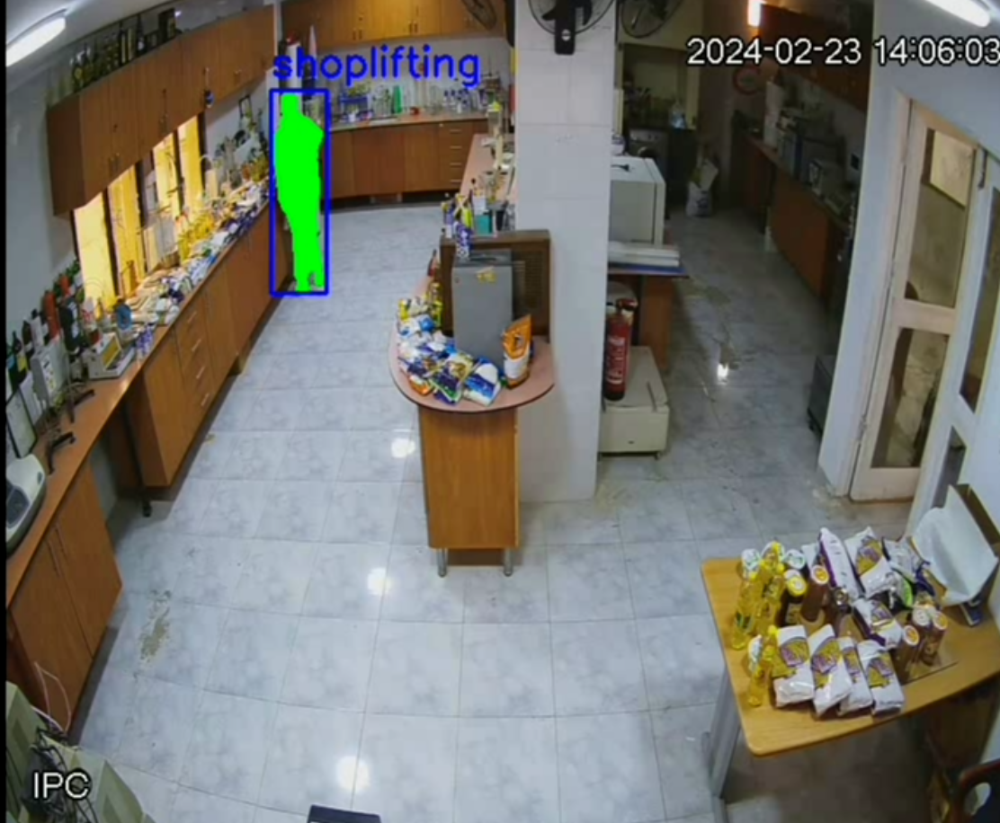

# Shoplifting Detection Project

This project aims to detect shoplifting activities in a retail environment by analyzing video frames. Two different approaches were used: one using YOLO-NAS and SAM for object detection and segmentation, and the other using a Hugging Face pre-trained model for video classification.

## 1. Dataset Preparation

- **Video Frame Extraction**: 
  - Extracted frames from video files that contain shoplifting and non-shoplifting activities.
  - Used YOLOv5 to detect persons in the frames and filtered frames that only contained individuals. 
  - Frames were labeled based on two classes:
    - `0`: Shoplifting
    - `1`: Non-shoplifting

- **Oversampling the Minority Class**:
  - To balance the dataset, oversampled the minority class (`shoplifting`) by duplicating images to ensure an even distribution between both classes.

## 2. Model Training - YOLO-NAS + SAM Approach

- **YOLO-NAS Custom Model**:
  - Trained a custom YOLO-NAS model using the prepared dataset. The model was designed to classify between two classes:
    - Shoplifting
    - Non-shoplifting
  - The model was trained using bounding box annotations from the dataset. These annotations focused on individuals in the video frames and classified their behavior accordingly.

- **Segmentation Using SAM (Segment Anything Model)**:
  1. The YOLO-NAS model detected the person and assigned the relevant class label (`shoplifting` or `non-shoplifting`).
  2. SAM was then applied to segment only the person within the bounding box provided by YOLO-NAS.
  3. The segmented mask helped focus on the action within the bounding box to better assess the behavior (shoplifting vs. non-shoplifting).

*The image above shows an example of the model detecting shoplifting and using SAM to segment the person involved.*

## 3. Video Processing Pipeline (YOLO-NAS + SAM)

- **Real-Time Detection**:
  - The pipeline was set to process videos in near real-time. 
  - Frames were analyzed by the YOLO-NAS model, and every person detected was segmented using SAM.
  
- **Frame Skipping**:
  - For efficiency, the model only processed frames every 5 seconds, starting from the 3-second mark of each video.

## 4. Model Performance (YOLO-NAS + SAM)

- The model was able to detect shoplifting behaviors with high accuracy after training, demonstrating that using YOLO-NAS for object detection and SAM for segmentation helped mitigate bias and generalize better to unseen individuals and scenarios.

## 5. Model Training - Hugging Face Pre-trained Model for Video Classification

In this approach, a Hugging Face pre-trained video classification model was used to classify video segments based on the shoplifting vs. non-shoplifting activities.

### Steps:

- **Storing Video Names in CSV**:
  - The video names were first stored in a CSV file to create a structured format for referencing during the training process.
  
- **Frame Extraction**:
  - Frames were extracted from each video at intervals of 16 frames (i.e., every 16 frames, one frame was used for analysis).
  - This ensured that the model captured sufficient temporal context to recognize the actions taking place.

- **Dataset Balancing**:
  - Similar to the YOLO-NAS approach, the dataset was balanced by oversampling the minority class (shoplifting) to ensure a more even distribution of both classes for training.

- **Model Training**:
  - A Hugging Face pre-trained model for video classification was fine-tuned on the extracted frames.
  - The model learned to classify the video segments as either `shoplifting` or `non-shoplifting` based on the actions and behaviors observed in the extracted frames.

## 6. Model Performance (Hugging Face Pre-trained Model)

- This approach leveraged the temporal context of videos and provided competitive results, classifying the behavior in the videos effectively.

